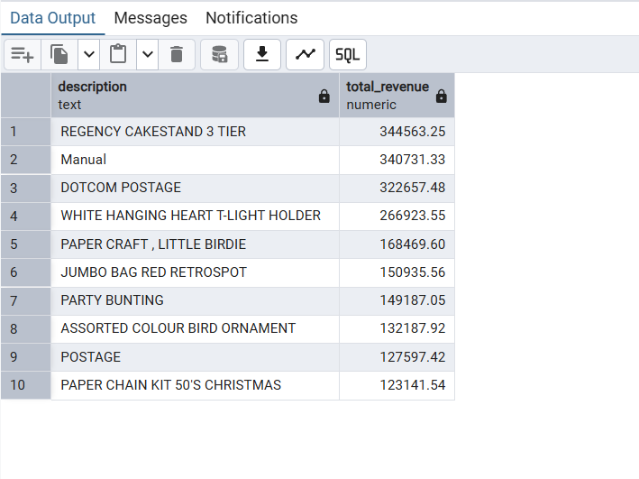
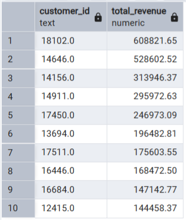
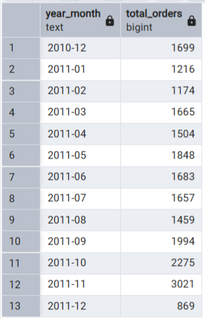
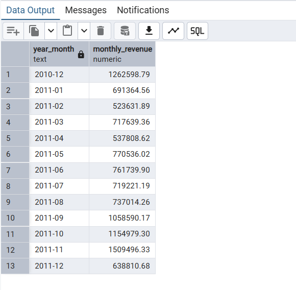
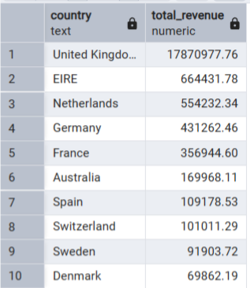
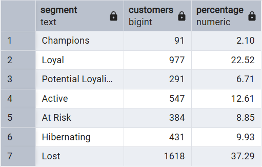

# 🛒 Online Retail — Customer Segmentation (RFM Analysis with SQL)

## 📊 Overview
Exploratory analysis of the *Online Retail II (UCI)* dataset using SQL (PostgreSQL + pgAdmin4), focused on uncovering sales trends, customer behaviors, and segmenting users through the RFM model.

- Analysis performed entirely in SQL  
- Computation of key KPIs across products, customers, time and countries  
- Customer segmentation using the RFM model  
- Identification of the most relevant purchasing patterns  

## 🛠 Methodology

### Data Cleaning & Preparation
- Removal of duplicates and invalid records  
- Handling of missing values  
- Identification of returns and non‑valid transactions  
- Creation of derived metrics

### KPI Computation
- Aggregations by product, customer, month and country  
- Calculation of orders, revenue and rankings  

### RFM Segmentation Logic
- Calculation of Recency, Frequency and Monetary  
- Assignment of R, F, M scores  
- Mapping into RFM segments 

## 📈 KPI Analysis

### 1) Top Products by Revenue

### 2) Top Customers by Revenue

### 3) Monthly Orders

### 4) Monthly Revenue

### 5) Revenue by Country

## 🎯 RFM Segmentation

### RFM Table

## 🔑 Key Insights

**1) UK market dominance**  
The United Kingdom generates the majority of total revenue, with a very large gap compared to other countries. Sales are therefore highly concentrated in a single primary market.

**2) Strong pre‑holiday seasonality**  
Orders and revenue peak in October–November, showing clear seasonality driven by pre‑holiday demand and increased purchases of decorative and gift‑related items.

**3) Concentration among top products**  
A small portion of the catalog generates a significant share of total revenue, showing a typical long‑tail distribution where a few items drive most of the sales.

**4) Large disparity among top customers**  
The highest‑value customer generates far more revenue than the tenth, indicating that a very small portion of the customer base contributes disproportionately to total revenue.

**5) Polarized RFM structure**  
The RFM segmentation reveals a polarized customer base: many *Lost* customers and a strong group of *Loyal* customers, with few in the intermediate segments. This suggests a binary purchasing pattern (occasional vs habitual).

## 📦 Dataset
- Name: *Online Retail II (UCI)*
- Source: Kaggle
- License: CC0 – Public Domain
